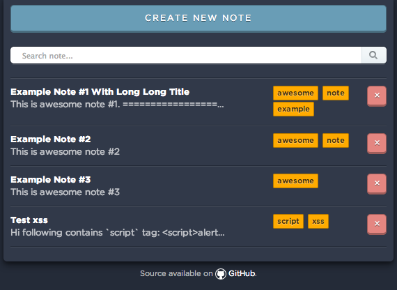

Yet Another Simple Note
=======================

Yet another Martini-powered RESTful API with Backbone-powered client consuming
the API.

## Screenshot



## Requirements

* Go
* Grunt (for building assets)

## Run Locally

1. Clone this repo
   ```
   git clone git@github.com:gedex/simple-note.git
   ```

2. Build everything
   ```
   make && make run
   ```

I've included `dist` assets, that's generated by Grunt, in this repo. In case
you don't have Grunt installed, running `make run` should starts the server. Or
you can run in development mode with `SIMPLE_NOTE_DEV=1 make run`.

## REST API

All API access is prefixed with `/api/v1`. By default, server is using port `8000`.
The full url of a single resource would be `http://localhost:8000/api/v1/resource`,
for example notes resource is located at `http://localhost:8000/api/v1/notes`.

### Notes

#### List notes

```
GET /notes
```

**Responses**

```
HTTP/1.1 200 OK
Content-Type: application/json; charset=UTF-8
Content-Length: 764
Date: Sat, 07 Jun 2014 09:44:10 GMT

[
    {
        "content": "This is awesome note #1.\n========================\n\nLets try with *Markdown*.",
        "content_html": "<h1>This is awesome note #1.</h1>\n\n<p>Lets try with <em>Markdown</em>.</p>\n",
        "id": 1,
        "tags": [
            {
                "id": 1,
                "name": "awesome"
            },
            {
                "id": 2,
                "name": "note"
            },
            {
                "id": 3,
                "name": "example"
            }
        ],
        "title": "Example Note #1 With Long Long Title"
    },
    {
        "content": "This is awesome note #2",
        "content_html": "<p>This is awesome note #2</p>\n",
        "id": 2,
        "tags": [
            {
                "id": 1,
                "name": "awesome"
            },
            {
                "id": 2,
                "name": "note"
            }
        ],
        "title": "Example Note #2"
    },
    {
        "content": "This is awesome note #3",
        "content_html": "<p>This is awesome note #3</p>\n",
        "id": 3,
        "tags": [
            {
                "id": 1,
                "name": "awesome"
            }
        ],
        "title": "Example Note #3"
    }
]
```

#### Get a single note

```
GET /notes/:id
```

**Responses**

```
HTTP/1.1 200 OK
Content-Type: application/json; charset=UTF-8
Content-Length: 387
Date: Sat, 07 Jun 2014 09:45:44 GMT

{
    "content": "This is awesome note #1.\n========================\n\nLets try with *Markdown*.",
    "content_html": "<h1>This is awesome note #1.</h1>\n\n<p>Lets try with <em>Markdown</em>.</p>\n",
    "id": 1,
    "tags": [
        {
            "id": 1,
            "name": "awesome"
        },
        {
            "id": 2,
            "name": "note"
        },
        {
            "id": 3,
            "name": "example"
        }
    ],
    "title": "Example Note #1 With Long Long Title"
}
```

#### List notes tagged particular tag specified by tag id

```
GET /notes/tag/:id
```

**Responses**

```
HTTP/1.1 200 OK
Content-Type: application/json; charset=UTF-8
Content-Length: 764
Date: Sat, 07 Jun 2014 09:46:49 GMT

[
    {
        "content": "This is awesome note #1.\n========================\n\nLets try with *Markdown*.",
        "content_html": "<h1>This is awesome note #1.</h1>\n\n<p>Lets try with <em>Markdown</em>.</p>\n",
        "id": 1,
        "tags": [
            {
                "id": 1,
                "name": "awesome"
            },
            {
                "id": 2,
                "name": "note"
            },
            {
                "id": 3,
                "name": "example"
            }
        ],
        "title": "Example Note #1 With Long Long Title"
    }
]
```

#### Create a note

```
POST /notes
```

**Example Request**

```
{
    "content": "test note",
    "title": "test"
}
```

**Responses**

```
HTTP/1.1 201 Created
Content-Type: application/json; charset=UTF-8
Content-Length: 113
Date: Sat, 07 Jun 2014 09:49:55 GMT

{
    "content": "test note",
    "content_html": "<p>test note</p>\n",
    "id": 4,
    "tags": null,
    "title": "test"
}
```

#### Edit a note

```
PUT /notes/:id
```

**Example Request**

```
{
    "content": "updated content",
    "tags": [
        {
            "name": "new tag"
        }
    ],
    "title": "updated title"
}
```

**Responses**

```
HTTP/1.1 200 OK
Content-Type: application/json; charset=UTF-8
Content-Length: 157
Date: Sat, 07 Jun 2014 09:52:43 GMT

{
    "content": "updated content",
    "content_html": "<p>updated content</p>\n",
    "id": 1,
    "tags": [
        {
            "id": 4,
            "name": "new tag"
        }
    ],
    "title": "updated title"
}
```

#### Delete a note

```
DELETE /notes:id
```

**Responses**

```
HTTP/1.1 204 No Content
Content-Type: application/json; charset=UTF-8
Content-Length: 2
Date: Sat, 07 Jun 2014 09:54:32 GMT
```

### Tags

#### List tags

```
GET /tags
```

**Responses**

```
HTTP/1.1 200 OK
Content-Type: application/json; charset=UTF-8
Content-Length: 102
Date: Sat, 07 Jun 2014 09:55:07 GMT

[
    {
        "id": 1,
        "name": "awesome"
    },
    {
        "id": 2,
        "name": "note"
    },
    {
        "id": 3,
        "name": "example"
    },
    {
        "id": 4,
        "name": "new tag"
    }
]
```
